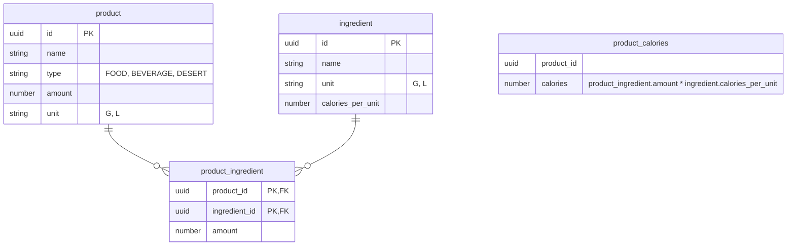

# Database ERD

```mermaid
erDiagram
  ingredient {
    uuid id PK
    string name
    string unit "G, L"
    number calories_per_unit
  }
  product {
    uuid id PK
    string name
    string type "FOOD, BEVERAGE, DESERT"
    number amount
    string unit "G, L"
  }
  product_ingredient {
    uuid product_id PK,FK
    uuid ingredient_id PK,FK
    number amount
  }
  %% View over product. The calories column is computed
  product_calories {
    uuid product_id
    number calories "product_ingredient.amount * ingredient.calories_per_unit"
  }

  product ||--o{ product_ingredient: ""
  ingredient ||--o{ product_ingredient: ""
```
